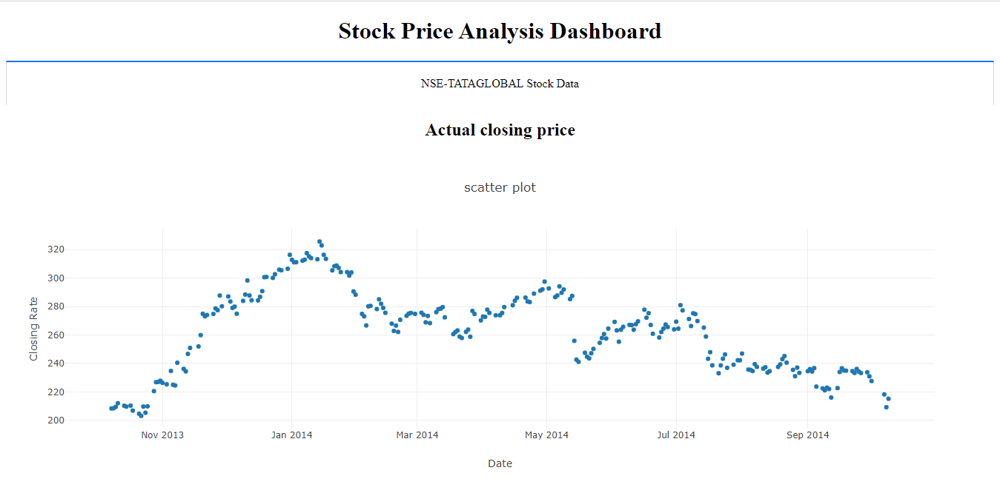

# Stock Price Prediction LSTM

## Table of Content
  * [Demo](#demo)
  * [Problem Statement](#problem-statement)
  * [Approach](#approach)
  * [Technologies Used](#technologies-used)
  * [Installation](#installation)
  * [Deployement on Heroku](#deployement-on-heroku)
  * [Detailed Project Reports](#detailed-project-reports)
  * [Bugs & Logs](#bugs--logs)
  * [Contributors](#contributors)

## Demo
Link: [https://stock-price-predictions-lstm.herokuapp.com/](https://stock-price-predictions-lstm.herokuapp.com/)




## Problem Statement
Predicting stock prices is an uncertain task which is modelled using machine learning to predict the return on stocks. There are a lot of methods and tools used for the purpose of stock market prediction. The stock market is considered to be very dynamic and complex in nature. An accurate prediction of future prices may lead to a higher yield of profit for investors through stock investments. As per the predictions, investors will be able to pick the stocks that may give a higher return.

Over the years, various machine learning techniques have been used in stock market prediction, but with the increased amount of data and expectation of more accurate prediction, the deep learning models are being used nowadays which have proven their advantage over traditional machine learning methods in terms of accuracy and speed of prediction. 

In this task, we will fetch the historical data of stock data and fit the LSTM model on this data to predict the future prices of the stock.

## Approach
Data Exploration : I started exploring dataset using pandas,numpy,matplotlib and seaborn.

Data visualization : Ploted graphs to get insights about dependend and independed variables.

Feature Engineering : Removed missing values and created new features as per insights.

Model Building & Testing : Tried many machine learning algorithms and checked the base accuracy to find the best fit.

User Interface & deployment :  Created an UI that shows the output.
                          After that I have deployed project on heroku.
## Technologies Used
 
   1. Python 
   2. Sklearn
   3. Tensorflow
   4. Matplotlib
   5. Pandas, Numpy
   6. RNN
   7. LSTM 

## Dataset
[Download here](https://github.com/hrishikeshkini/Stock-Price-prediction-LSTM/blob/main/NSE-Tata-Global-Beverages-Limited.csv)

## Installation
Click here to install [python](https://www.python.org/downloads/). To install the required packages and libraries, run this pip command in the project directory after cloning the repository:
```bash
git clone https://github.com/hrishikeshkini/Stock-Price-prediction-LSTM.git
pip install -r requirements.txt
```
If pip is not already installed, Follow this [link](https://pip.pypa.io/en/stable/installation/)

## Deployement on Heroku
Create a virtual app on Heroku website. You can either connect your github profile or download cli to manually deploy this project.
Follow the instruction given on [Heroku Documentation](https://devcenter.heroku.com/articles/getting-started-with-python) to deploy a web app.

## Bugs & Logs

1. If you find a bug, kindly open an issue and it will be addressed as early as possible. [Open](https://github.com/hrishikeshkini/Stock-Price-prediction-LSTM/issues)
2. Under localhost, logging is performed for all the actions and its stored onto logs.txt file
3. When the app is deployed on heroku, logs can be viewed on  heroku dashboard or CLI.

## Contributors
  [Hrishikesh Kini](https://github.com/hrishikeshkini)

